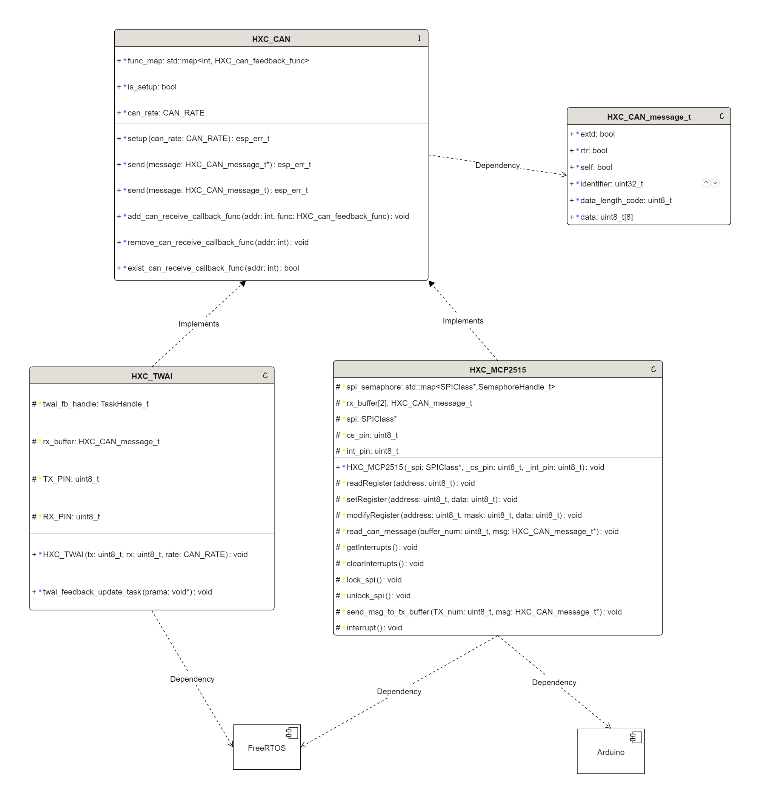

<!--
 * @version: no version
 * @LastEditors: qingmeijiupiao
 * @Description: 
 * @Author: qingmeijiupiao
 * @LastEditTime: 2025-07-17 10:17:02
-->

## UML图


## 概述
HXC_CAN是一个CAN通信的基类，提供了CAN消息的发送、接收和回调处理功能。
并且提供了ESP32 的TWAI和MCP2515两种CAN通信方式的封装，方便用户使用。

## 枚举类型

### CAN_RATE
`CAN_RATE` 是一个枚举类型，用于定义不同的CAN通信速率。以下是具体的速率选项：

- `CAN_RATE_1MBIT`: 表示1Mbps的通信速率。
- `CAN_RATE_800KBIT`: 表示800Kbps的通信速率。
- `CAN_RATE_500KBIT`: 表示500Kbps的通信速率。
- `CAN_RATE_250KBIT`: 表示250Kbps的通信速率。
- `CAN_RATE_125KBIT`: 表示125Kbps的通信速率。
- `CAN_RATE_100KBIT`: 表示100Kbps的通信速率。

## 消息结构体

### HXC_CAN_message_t
`HXC_CAN_message_t` 结构体定义了CAN消息的格式，包含以下成员：

- `bool extd`: 扩展帧格式标志，用于标识是否为29位ID的扩展帧。默认为0，表示标准帧（11位ID）。
- `bool rtr`: 远程帧标志，用于标识是否为远程请求帧。默认为0，表示数据帧。
- `bool self`: 自我接收请求标志，用于发送时请求自我接收。在接收时此标志无效。默认为0。
- `uint32_t identifier`: 11位或29位的标识符，根据`extd`标志确定。
- `uint8_t data_length_code`: 数据长度代码，表示数据字段的长度，范围从0到8。
- `uint8_t data[8]`: 数据字节数组，用于存储实际的数据内容。在远程请求帧（RTR帧）中，此字段不包含数据。

## 回调函数
本库仅提供通过回调函数的方式接收CAN消息。
### HXC_can_feedback_func
`HXC_can_feedback_func` 是一个类型别名，定义了CAN消息接收回调函数的类型。它是一个函数对象，可以接受一个指向`HXC_CAN_message_t`结构体的指针作为参数，并在接收到CAN消息时被调用。

```cpp
using HXC_can_feedback_func = std::function<void(HXC_CAN_message_t* can_message)>;
```

## HXC_CAN类
### 初始化
必须初始化才能使用CAN消息收发
- **setup(CAN_RATE can_rate)**: 初始化CAN通信，设置通信速率。
  - **参数**:
    - `can_rate`: `CAN_RATE` 枚举值，指定CAN通信速率。
  - **返回值**: `esp_err_t` 类型，成功返回ESP_OK，否则返回ESP_FAIL。

### 发送CAN消息
- **send(HXC_CAN_message_t* message)**: 发送CAN消息，通过消息指针。
  - **参数**:
    - `message`: `HXC_CAN_message_t*` 类型，指向CAN消息的指针。
  - **返回值**: `esp_err_t` 类型，成功返回ESP_OK，否则返回ESP_FAIL。
- **send(HXC_CAN_message_t message)**: 发送CAN消息，通过消息对象。
  - **参数**:
    - `message`: `HXC_CAN_message_t` 类型，CAN消息对象。
  - **返回值**: `esp_err_t` 类型，成功返回ESP_OK，否则返回ESP_FAIL。

### 回调函数管理
- **add_can_receive_callback_func(int addr, HXC_can_feedback_func func)**: 添加CAN消息接收回调函数。
  - **参数**:
    - `addr`: `int` 类型，CAN消息地址。
    - `func`: `HXC_can_feedback_func` 类型，回调函数。
- **remove_can_receive_callback_func(int addr)**: 移除CAN消息接收回调函数。
  - **参数**:
    - `addr`: `int` 类型，CAN消息地址。
- **exist_can_receive_callback_func(int addr)**: 判断是否存在指定地址的CAN消息接收回调函数。
  - **参数**:
    - `addr`: `int` 类型，CAN消息地址。
  - **返回值**: `bool` 类型，存在返回true，否则返回false。

### 状态查询
- **get_setup_flag()**: 查询CAN是否已初始化。
  - **返回值**: `bool` 类型，已初始化返回true，否则返回false。

## 注意事项
- 该类的所有成员函数和变量都应通过派生类实现具体功能。
- 拷贝构造函数、拷贝赋值函数、移动构造函数和移动赋值函数均被删除，以防止值传递CAN对象。
